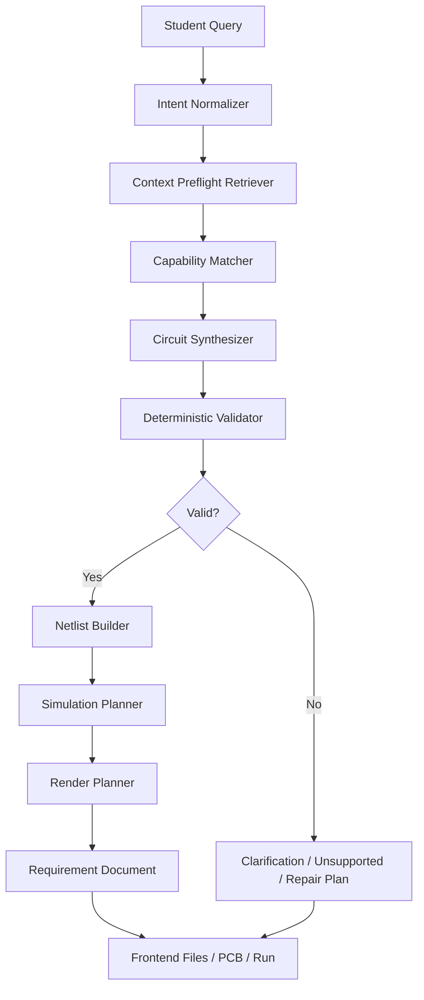

# H-eduware Generalized Hardware Simulation Improvement Plan

## 1. Problem Reframing

The product goal is not to pass a fixed list of OLED, LED, button, buzzer, servo, or potentiometer demos. Those cases are useful regression probes, but they are not the objective.

The real objective is:

> Given arbitrary student circuit requests, H-eduware should reliably transform the request into a grounded, safe, validated, visually inspectable, and simulation-ready educational hardware project, or clearly explain why it cannot do so yet.

This means the system must generalize across:

- Different student wording, languages, mistakes, and ambiguity.
- Different hardware classes, not just named demo fixtures.
- Different wiring topologies, pin aliases, protocols, and power assumptions.
- Different simulation semantics such as steady-state current, digital state, PWM, analog input, communication bus behavior, and safety warnings.
- Unsupported or unsafe requests where the correct output is refusal, clarification, or a constrained alternative.

The implementation should therefore optimize for a general circuit-intelligence pipeline, not a sequence of hand-tuned examples.

## 2. Current State

### 2.1 What Already Works

- The live Deepagents path is connected through the server.
- The frontend chat calls the agent endpoint instead of a rule-based local mock.
- The server has deterministic Zod schemas and validation tools.
- The context layer already contains a useful structure:
  - always-loaded `AGENTS.md`
  - skill docs
  - registry files
  - ontology files
  - electrical rules
  - simulation references
  - eval corpora
- The server validates circuit specs independently after the model proposes them.
- The app can render a validated circuit into Files, PCB, and Run tabs.
- Browser and Playwright E2E can verify that the canvas is not blank.

### 2.2 Main Weaknesses

The system is not yet generalized enough because:

- Context retrieval is available, but not yet enforced as a first-class preflight step.
- The model can still draft from its own latent assumptions instead of a required context packet.
- Context usage is not exposed as traceable evidence in the response.
- Supported hardware is represented as a small starter registry, while the visual part library already contains many more real parts.
- The renderer still has demo-era assumptions in the stage layout and pin-anchor handling.
- Simulation logic is still part-specific and shallow, rather than primitive-based.
- Evaluation is example-driven, but not yet coverage-driven across hardware capability classes.

## 3. Target Architecture

The target system should become a context-forced, capability-driven, validation-first workflow.



The model should not be treated as the source of truth. It should be an orchestrator and synthesizer whose output is accepted only after canonical context and deterministic validators agree.

## 4. Core Design Principles

### 4.1 Hardware Cases Are Eval Probes, Not Product Scope

OLED, LED, button, buzzer, servo, potentiometer, sensors, and motors should be used to test coverage, not to define the product boundary.

The implementation should avoid this anti-pattern:

> If prompt contains "OLED", generate hardcoded OLED demo.

The desired pattern is:

> Infer requested behavior, retrieve compatible capabilities, synthesize a circuit from canonical part/pin/protocol rules, validate it, then compile visualization and simulation artifacts from the validated spec.

### 4.2 Context Must Be Forced

The agent should not merely be able to call context tools. The server should force a context packet before model synthesis.

Required context preflight:

- Parse the user request into preliminary signals:
  - likely output devices
  - likely input devices
  - controller assumptions
  - protocols
  - power requirements
  - unsafe phrases
  - ambiguity
- Query context layer deterministically:
  - part registry
  - pin aliases
  - safety rules
  - protocol rules
  - simulation primitive mapping
  - render footprint catalog
- Build a compact context packet.
- Pass that packet to Deepagents as non-negotiable grounding.
- Store context trace in the final result.

### 4.3 Validation Owns Truth

The model may propose a circuit, but only deterministic server tools can decide:

- whether parts exist
- whether pins exist
- whether power rails are valid
- whether common ground exists
- whether required passives are present
- whether current paths are allowed
- whether a simulation can be shown
- whether a request is unsupported

### 4.4 Visualization Must Consume RenderPlan, Not Demos

The PCB/3D stage should not know about "the OLED demo." It should know:

- part footprint
- part dimensions
- visual style: mesh shape, color, and material intent
- pin anchors
- breadboard coordinates
- wire endpoints
- connection role
- simulation overlays
- hover/selection targets

If a hardware request validates but cannot be visualized, that is a renderer capability gap and should be reported explicitly.

### 4.5 Simulation Must Be Primitive-Based

Simulation should be composed from primitives instead of one branch per part.

Primitive families:

- DC supply path
- digital output load
- digital input pull-up or pull-down
- PWM-controlled load
- analog voltage divider
- I2C bus
- servo control signal
- audible output
- display state
- sensor readout
- unsafe or unsupported power domain

Each part maps to one or more primitives. Each primitive defines validation requirements, expected states, current paths, UI controls, animation cues, and warning conditions.

## 5. Data Model Improvements

### 5.1 Hardware Capability Graph

Introduce a capability graph over the part registry.

Each part should declare:

- aliases and natural-language phrases
- category
- required pins
- optional pins
- pin roles
- acceptable voltage domains
- current limits
- protocol support
- required passive components
- compatible controller pins
- compatible simulation primitives
- compatible render footprint
- known beginner mistakes
- safe substitutes

Example capability relation:

```json
{
  "partId": "potentiometer-10k",
  "capabilities": ["analog-input", "voltage-divider"],
  "requires": ["controller-analog-input", "power", "ground"],
  "pins": {
    "VCC": "power",
    "WIPER": "analog-signal",
    "GND": "ground"
  },
  "simulationPrimitives": ["analog-voltage-divider"],
  "renderFootprint": "rotary-potentiometer"
}
```

### 5.2 IntentSpec Expansion

`IntentSpec` should support:

- `studentGoal`
- `requestedBehavior`
- `inputModalities`
- `outputModalities`
- `controllerPreference`
- `powerAssumptions`
- `safetyConcerns`
- `ambiguities`
- `unsupportedSignals`
- `repairCandidates`
- `confidence`

The agent should generate this before attempting `CircuitSpec`.

### 5.3 CircuitSpec Expansion

`CircuitSpec` should distinguish:

- functional intent
- physical components
- logical nets
- physical wires
- breadboard placements
- assumptions
- open questions
- unsupported items
- safety constraints
- render requirements
- simulation requirements

### 5.4 ContextTrace

Add a `contextTrace` field to `AgentRunResult`.

It should include:

- loaded always-memory docs
- context docs retrieved
- registry entries used
- validation rules applied
- simulation recipes applied
- unsupported rules triggered
- compact summaries, not long document dumps

Example:

```json
{
  "contextTrace": [
    {
      "sourceId": "registry:part-capabilities:oled-i2c-096",
      "reason": "Matched student request for small OLED text display.",
      "usedFields": ["pins", "protocols", "electrical", "simulationModel"]
    },
    {
      "sourceId": "electrical:netlist-rules",
      "reason": "Required common ground before current path simulation."
    }
  ]
}
```

## 6. Agent Workflow Improvements

### 6.1 Required Deepagents Subflow

The coordinator should follow this sequence:

1. `intent-analyst`
   - Produce structured `IntentSpec`.
   - Identify ambiguity and risk.

2. `context-retriever`
   - Must use deterministic retrieval before synthesis.
   - Return concise context packet.

3. `capability-matcher`
   - Map intent to possible part/capability sets.
   - Rank candidates.
   - Identify unsupported requests.

4. `circuit-synthesizer`
   - Draft candidate circuits using only context packet entries.
   - Do not invent ids, pins, or protocols.

5. `constraint-validator`
   - Call deterministic validation tools.
   - Return authoritative errors and repair hints.

6. `simulation-planner`
   - Generate simulation only from validated netlist and primitive mappings.

7. `lesson-explainer`
   - Explain result in student language.
   - Include clarifying question if needed.

### 6.2 Server-Side Enforcement

The server should enforce:

- No model invocation without context packet.
- No final valid result without deterministic validation.
- No current animation without validated current paths.
- No verified visualization without render anchors. Hardware-shaped unsupported specs may still show diagnostic context, and missing exact footprints may use placeholder geometry when clearly marked.
- No unsupported part silently substituted without explanation.
- No high-voltage or unsafe original circuit rendered as build-ready. Use clarification/no-scene or a clearly labeled safe-equivalent scene instead.

### 6.3 Repair Loop

If validation fails, do not immediately return a generic failure.

Use a bounded repair loop:

- attempt 1: validator returns errors
- attempt 2: model receives exact errors and context packet
- attempt 3: if still invalid, return clarification or unsupported status

Repair loop must be deterministic in count and must not hide validation failures.

## 7. Context Layer Implementation Plan

### Phase A: Context Index Hardening

Add machine-readable indexes for:

- part capability graph
- pin alias graph
- simulation primitive map
- render footprint map
- safety rule map
- protocol rule map
- common student phrase map

Every document should have:

- stable id
- path
- summary
- applicable hardware classes
- applicable simulation primitives
- schema or data owner

### Phase B: Context Packet Builder

Create server-side `buildContextPacket(intentDraft)`:

- input: raw student message and optional session state
- output:
  - candidate parts
  - candidate primitives
  - required docs
  - safety constraints
  - unsupported signals
  - render constraints
  - validation rules

The packet should be compact enough for the model but complete enough to ground synthesis.

### Phase C: Context Trace

Add trace output to:

- API response
- Files tab
- optional debug panel in UI
- E2E snapshots

The user-facing UI should show a readable version:

> 참고한 기준: Arduino Uno pin map, OLED I2C protocol, common ground rule, current-flow recipe.

### Phase D: Context Coverage Tests

Tests should verify:

- every registry part has a render footprint or an explicit no-render status
- every simulation primitive has validation rules
- every supported protocol has pin rules
- every alias resolves to canonical part/pin ids
- no context references point to missing files

## 8. Simulation Generalization Plan

### 8.1 Simulation Primitive Engine

Introduce `SimulationPrimitive` records:

```ts
type SimulationPrimitive = {
  id: string;
  requiredNetRoles: string[];
  requiredComponents: string[];
  validationRules: string[];
  currentPathRecipe: string;
  expectedStateRecipe: string;
  uiControls: string[];
  animationCues: string[];
  limitations: string[];
};
```

### 8.2 Primitive Examples

- `dc-load`
  - LED, buzzer, small output modules.
- `digital-input-pulldown`
  - button to digital pin and ground.
- `pwm-output`
  - servo signal, LED dimming.
- `analog-voltage-divider`
  - potentiometer, photoresistor.
- `i2c-display`
  - OLED or LCD backpack.
- `sensor-readout`
  - ultrasonic, temperature/humidity, light sensor.

### 8.3 Simulation Output Contract

Each valid simulation should provide:

- current paths
- expected states
- student-facing explanation
- UI controls
- warnings
- unsupported limitations
- animation cues

Current path ids, semantic kind, labels, source endpoint strategy, through-segment strategy, return endpoint strategy, and animation defaults should come from `SimulationPrimitive.currentPathRecipe.pathTemplate` or `pathTemplates`, not from part-specific branches in the compiler.

The supported semantic path kinds are now:

- `load-current`: measured or estimated current through an output load.
- `supply-current`: module or actuator supply current.
- `signal-activity`: low-current digital/PWM signal behavior.
- `bus-activity`: communication bus activity such as display data updates.
- `sensing-divider`: analog sensing divider behavior.
- `fault-current`: blocked or unsafe current-path warning semantics.

Simulation plans must animate only path ids that deterministic validation returned in `validatedCurrentPathIds`. A path whose primitive id is unknown, or whose id was not validated, is treated as a simulator support gap and becomes a warning instead of an animated overlay.

The app should make it obvious when something is simulated approximately rather than physically solved by SPICE.

## 9. Visualization Generalization Plan

### 9.1 Render Footprint Catalog

Every renderable part needs:

- geometry type
- size
- color tokens
- material intent
- pin anchors
- label anchors
- breadboard placement constraints
- inspection targets
- supported simulation overlays

The starter footprint catalog now includes `hoverTargets` for body-level and pin-level inspection. These targets identify what a student can ask about, such as polarity, power rails, I2C data, PWM signal, ground return, or current-limiting behavior.

### 9.2 Layout Engine

Replace demo-specific stage placement with:

- board coordinate system
- component placement solver
- pin-anchor resolver
- wire routing
- collision avoidance
- camera framing
- floating card placement

### 9.3 Visual Fallback Rules

If a part validates electrically but has no visual footprint:

- do not silently render the wrong thing
- show a generic module only if declared allowed
- show a visible "visual footprint missing" warning
- block current animation if endpoint anchors are missing

`compileRenderPlan()` now emits structured `MISSING_RENDER_FOOTPRINT` warnings. Agent-created projects preserve these warnings as a Files-tab Markdown document and as a compact PCB warning panel, so visual coverage gaps are visible to the student instead of hidden in server logs.

## 10. Evaluation Strategy

### 10.1 Evaluation Should Measure Generalization

The evaluation corpus should not be "one prompt per hardware demo." It should contain prompt families.

Prompt families:

- display text requests
- light output requests
- sound output requests
- motion output requests
- button/switch input requests
- analog knob requests
- sensor readout requests
- multiple output requests
- ambiguous beginner requests
- unsafe high-voltage requests
- unsupported wireless/robot/drone requests
- requests with wrong pin names
- requests missing resistor or ground
- multilingual Korean/English mixed requests
- typo-heavy student requests

### 10.2 Required Eval Metrics

Track:

- intent extraction accuracy
- part matching accuracy
- unsupported detection accuracy
- validation error accuracy
- successful repair rate
- simulation availability rate
- visualization availability rate
- hallucinated part/pin rate
- unsafe false positive and false negative rate
- clarification quality

### 10.3 Browser Verification

For each major prompt family:

1. Open `http://127.0.0.1:4173/`.
2. Submit a natural student prompt.
3. Wait for Deepagents response.
4. Confirm only if valid.
5. Inspect Files tab.
6. Inspect PCB tab.
7. Verify canvas is nonblank.
8. Hover/select parts and wires.
9. Ask inspector chat a question about the selected target.
10. Run simulation.
11. Verify visible state and current animation.
12. Capture screenshot evidence.

Browser verification should be used to catch UX and visualization failures that API tests cannot catch.

## 11. Implementation Roadmap

### Milestone 1: Context-Forced Agent

Deliverables:

- `buildContextPacket`
- `ContextTraceSchema`
- `AgentRunResult.contextTrace`
- mandatory context packet injection
- UI display of context sources
- tests proving context trace exists for valid and unsupported results

Success criteria:

- Agent cannot produce a valid result without registry-backed context.
- Response exposes which context was used.
- Unsupported requests cite the policy or capability gap.

### Milestone 2: Capability Graph

Deliverables:

- capability graph data
- alias resolver
- part/pin/protocol compatibility matcher
- context coverage tests

Success criteria:

- Student wording maps to canonical parts without hardcoded prompt branches.
- Pin aliases resolve consistently.
- Unsupported hardware is detected before synthesis.

### Milestone 3: Primitive-Based Simulation

Deliverables:

- simulation primitive schema
- primitive mapping data
- current path compiler by primitive
- expected state compiler by primitive
- UI control descriptors

Success criteria:

- Simulation is not tied to a single part id branch.
- New parts can reuse existing primitives.
- Invalid circuits never show current animation.

### Milestone 4: General Render Engine

Deliverables:

- render footprint catalog
- pin-anchor resolver
- component placement solver
- wire routing from renderPlan
- missing footprint warnings

Success criteria:

- 3D stage renders from generic `RenderPlan`.
- Component ids generated by the model do not break rendering.
- Browser screenshots differ meaningfully by hardware class.

### Milestone 5: Generalization Eval Suite

Deliverables:

- prompt family corpus
- live smoke suite
- deterministic context/validation suite
- Browser visual verification protocol
- failure taxonomy report

Success criteria:

- Evaluation reports coverage and failure classes, not just pass/fail.
- A failed prompt produces actionable cause: context gap, registry gap, validator gap, renderer gap, or model synthesis gap.

### Milestone 4.5: Target-Grounded Tutor

Status: initial implementation complete.

The inspector/tutor server contract now requires a selected target plus active circuit artifacts: `CircuitSpec`, `ValidationReport`, `SimulationPlan`, and `contextTrace`. Tutor grounding includes selected target ids, endpoint labels, validation status, simulation status, validated current path ids, simulation current path ids, and context trace source ids. If validation or simulation is not valid, current-flow questions are answered as blocked rather than as unsupported physical claims.

## 12. Risk Register

### Risk: Model Invents Parts Or Pins

Mitigation:

- forced context packet
- strict schemas
- deterministic part/pin validation
- repair loop with exact errors

### Risk: Visual Layer Lags Behind Agent Capability

Mitigation:

- render footprint coverage tests
- explicit visual unsupported status
- generic footprint only when declared

### Risk: Simulation Overclaims Physics

Mitigation:

- simulation truthfulness policy
- primitive limitations
- no SPICE claims
- visible warnings for approximate behavior

### Risk: Tests Become The Product Definition

Mitigation:

- prompt-family evals
- coverage metrics
- randomized paraphrases
- regression examples treated as probes only

### Risk: Live Model Variability

Mitigation:

- deterministic server validation
- bounded repair loop
- structured output
- live smoke tests separated from deterministic unit tests

## 13. Definition Of Done

The generalized hardware simulation upgrade is done when:

- arbitrary beginner prompts are grounded through context before synthesis
- final valid circuits include context trace, validated netlist, render plan, and simulation plan
- clarification-only/meta unsupported prompts remain no-scene with precise reasons
- unsupported hardware prompts may render diagnostic context without Run/current animation/build-ready claims
- unsafe prompts are rejected/clarified or replaced by a clearly labeled safe-equivalent scene
- visualization is generated from generic footprints and pin anchors
- simulation is generated from reusable primitives
- Browser E2E confirms Files, PCB, hover/inspector chat, and Run behavior
- evaluation reports generalization coverage and failure categories
- `npm run check` passes

## 14. Immediate Next Action

Do not add another fixed demo first.

The next implementation should begin with:

1. Add `ContextTraceSchema`.
2. Add server-side `buildContextPacket`.
3. Force Deepagents to use that packet.
4. Expose context trace in API and UI.
5. Add tests that fail if a valid circuit lacks context evidence.

After that, expand hardware capability coverage through data and primitives, not hardcoded case order.

## 15. Implementation Checkpoint

Status as of the current implementation pass:

- `ContextTraceSchema` exists and `AgentRunResult.contextTrace` is required.
- The server builds a request-specific `ContextPacket` before Deepagents synthesis.
- The Deepagents system prompt receives the forced context packet.
- The frontend exposes context evidence as a generated Markdown file in the Files panel.
- The agent model config is now local-env driven; the current local live run is set to `gpt-5.5` with `xhigh` reasoning, and the live OpenAI path forces the Responses API so Deepagents tools and reasoning settings are compatible.
- `IntentSpecV2` now exists as a structured pre-synthesis intent artifact with student goal, behavior triggers/actions, input and output modalities, controller and power assumptions, ambiguity, safety signals, unsupported signals, language, and confidence.
- `ContextPacket` now carries `intentSpec` and injects it into the Deepagents prompt before the older `intentHints` summary, so student requests are represented as behavior and modality facts rather than only demo-like categories.
- `agent-context/data/capability-graph.json` now maps student-language capability requests to support level, required parts, validation rules, render footprints, and simulation primitives.
- `server/context/capabilityGraph.ts` now loads and matches the capability graph deterministically.
- Capability matching now rejects generic Arduino/breadboard/current-flow wording as sufficient evidence, so an OLED request does not pull in unrelated LED, button, buzzer, or servo capabilities.
- Capability matching now also requires input-specific evidence for sensor, analog, button, and other input-driven capabilities, so a simple LED/resistor request is not promoted into a planned light-sensor context gap.
- `CapabilityGraphEntrySchema` now requires data-owned retrieval metadata: `positivePhrases`, `requiredEvidence`, `negativeEvidence`, and `minimumScore`.
- `server/context/capabilityGraph.ts` now computes a normalized retrieval score from positive phrase hits, required evidence, modality evidence, negative evidence, and each capability's minimum score. Single-token evidence uses exact token matching, so `led` no longer matches the `oled` substring.
- `server/context/pinAliases.ts` now resolves canonical pin aliases, including Korean aliases such as power and ground terms.
- `ContextPacket` now includes `capabilityMatches` and `supportGaps`; planned or unsupported capabilities are not silently promoted to supported.
- `ContextPacket` and `AgentRunResult` now include `contextCoverage`, a compact report with status, score, required source types, present source types, missing source types, and warnings.
- `contextCoverage` marks planned, unsupported, ambiguous, and under-grounded requests as insufficient instead of letting the agent imply that latent model knowledge is enough.
- `server/agent/circuitTools.ts` now exposes a deterministic `applyContextCoverageGate()` helper. Otherwise valid circuits are downgraded to invalid when `contextCoverage.status` is `insufficient`, with `CONTEXT_COVERAGE_INSUFFICIENT` in the validation errors and no validated current path ids.
- `server/agent/deepAgentRuntime.ts` now compiles render plans, simulation plans, requirement markdown, validation events, and clarification text from the coverage-gated validation report instead of the raw validator report.
- Tests now prove that insufficient coverage blocks build-ready claims and current animation even for an electrically valid LED circuit. Hardware-shaped unsupported specs may still expose diagnostic render context when `solverGateResult.visibleSimulation` allows it.
- `server/context/contextLayer.ts` now exposes `auditCapabilityCoverage()`, a data-bundle promotion audit that blocks any capability from being treated as supportable unless capability graph, part registry, pin aliases, validation rules, simulation primitives, render footprints, supported eval prompts, and unsupported counterexamples are all present.
- Capability promotion tests now prove that incomplete planned families such as `analog-led-dimmer` stay blocked when `potentiometer-10k`, render, validation, or eval evidence is missing, while fully grounded starter capabilities such as `display-text-output` pass the audit.
- Tests now fail if generalized OLED requests lack capability graph evidence or if planned potentiometer-style dimming is treated as fully supported.
- `agent-context/electrical/topology-templates.json` now defines reusable role-based topology templates for I2C modules, protected digital loads, switch-input plus output circuits, direct low-current loads, and PWM actuators.
- `CapabilityGraphEntry.requiredRoles` now connects student-facing capabilities to topology roles, so the server can select circuit structure from roles rather than from a fixed hardware sequence.
- `server/agent/circuitTools.ts` now exposes `selectTopologyTemplate()` and records selected topology evidence in `ValidationReport.electricalAnalysis`, including topology id, label, roles, and validation rules.
- `server/agent/deepAgentRuntime.ts` now uses a bounded validation repair loop. A failed draft can be retried once with exact deterministic validation errors, and the result records `validation-repair` or `validation-repair-exhausted` events instead of hiding the failure.
- `runAgentWithScriptedDrafts()` gives the test harness a no-network way to exercise the same repair path, including proving that a third valid draft is not consumed after two invalid attempts.
- `agent-context/simulation/primitives.json` now defines explicit primitive contracts: required net roles, validation rules, current path recipes, expected state recipes, UI controls, animation cues, render overlays, and truthfulness limitations.
- `agent-context/simulation/primitives.json` now defines machine-readable `currentPathRecipe.pathTemplate` and `pathTemplates` metadata for run-capable primitives, including stable path id, semantic kind, label, source endpoint strategy, through path segments, return endpoint strategy, fallback controller pin, optional current estimate override, and animation defaults.
- `agent-context/data/render-footprints.json` now defines pin anchors, label anchors, placement constraints, and simulation overlay anchors for the supported starter footprints.
- `agent-context/data/render-footprints.json` now also defines `visualStyle` metadata for supported footprints, including stage mesh shape, hex color, and material intent.
- `ContextPacket` now injects the selected simulation primitive contracts and render footprint anchors, with trace entries such as `data:simulation-primitives:*` and `rendering:render-footprint:*`.
- Context coverage tests now cross-check supported parts, capability graph entries, simulation primitives, and render footprints by support level.
- Deterministic simulation artifacts now cite the primitive contract used for each generated current path and expected state through `primitiveId` and explanation fields.
- Deterministic current path estimation now consumes primitive path template metadata for path id, semantic kind, label, source, through segments, return endpoint, current estimate overrides, and animation defaults.
- Multi-path simulation templates are now supported for servo behavior: the simulator can represent supply current and PWM signal activity as separate validated paths without treating the PWM line as a 0 mA load current.
- Multi-path simulation templates now also cover planned sensor-display and analog-threshold semantics at the primitive contract level. `display_sensor_value` separates supply current, sensor signal activity, and display bus activity; `analog_threshold` separates sensing-divider behavior from output-load current. These primitives still require full registry, validation, rendering, and eval bundles before their hardware families are promoted to supported.
- `compileSimulationPlan()` now filters current paths through deterministic `validatedCurrentPathIds` and known simulation primitive ids before exposing animation paths to the frontend.
- The three.js stage now exposes semantic overlay styles for load current, supply current, signal activity, bus activity, sensing dividers, and fault-current warnings, and it returns no current-path descriptors unless the simulation plan is valid.
- The render plan compiler now resolves endpoint coordinates from context-layer render footprint pin anchors.
- The three.js stage endpoint resolver now consumes `renderPlan.layout.endpoints` first while preserving legacy demo fallback endpoints for partial layouts.
- `agent-context/evals/context-sufficiency-prompts.jsonl` now defines prompt-family coverage for supported, planned, unsupported, and ambiguous student requests.
- Context packet tests now verify that sensor requests such as ultrasonic distance display and photoresistor-triggered LED are treated as `planned` support gaps instead of being silently promoted to supported circuits.
- Context packet tests now verify that autonomous wireless robotics, home-security actuators, and mains-power requests are classified through unsupported capability evidence and unsupported signal detection.
- Coverage scoring caught an OLED/display overmatch: generic display tokens such as OLED or screen are now treated as display evidence, not as sufficient evidence for distance-sensor-display or other sensor capabilities.
- Capability evals now include negative app-screen/current-flow wording so UI visualization requests do not become fake OLED hardware requests.
- The three.js stage now creates generic render descriptors for non-OLED parts such as LED, resistor, button, buzzer, and servo from `RenderPlan.parts`.
- Demo-era unconditional OLED and library-only sensor/motor rendering has been removed. Specialized OLED and library-only parts now render only when the active `RenderPlan` declares them.
- `RenderPlan.parts` now carry footprint metadata from `agent-context/data/render-footprints.json`, and stage generic descriptors prefer those footprint dimensions and visual style values over local fallback profiles.
- Starter render footprints now expose `hoverTargets`, and stage descriptors carry that metadata forward so inspector/tutor features can ground answers in the same footprint catalog used for rendering.
- `RenderPlan.warnings` now reports visual capability gaps such as `MISSING_RENDER_FOOTPRINT`, and the frontend surfaces those warnings in both Files and PCB views.
- The context layer now has explicit hierarchical routing via `agent-context/routing/context-routing-map.json` and `agent-context/routing/retrieval-budget.md`.
- `ContextPacket` now exposes `contextRoute` and `retrievalPlan`, so request-specific context loading is observable and testable at source-id level.
- `buildContextPacket()` now chooses a route before loading registry, rendering, and simulation assets. Ambiguous app-screen visualization requests stay on a minimal clarification route. Unsupported clarification/meta turns remain no-scene; hardware-shaped unsupported or unsafe turns may route to diagnostic context or safe-equivalent rendering without opening Run/build-ready claims.
- The live Deepagents prompt now receives only route-selected candidate registry entries instead of a full registry dump.
- `npm run eval:generalization` now exercises the prompt-family corpus through context routing and checks failure taxonomy, retrieval budgets, capability matches, forbidden overmatches, support gaps, unsafe signals, and ambiguity handling.
- The eval corpus now includes display, light, sound, motion, digital input, analog input, sensor readout, multi-output, ambiguous, unsafe, unsupported, mixed-language, and typo-heavy prompt families.
- `docs/browser_generalization_verification.md` now defines the browser protocol for checking chat safety, Files evidence, PCB rendering, hover/selection, tutor grounding, Run behavior, and failure-class recording.
- Default E2E now includes an offline-safe product-experience verification that checks requirement files, nonblank three.js canvas pixels, wire selection, part selection, tutor chat, and Run output without requiring a paid live model call.
- Agent-created projects now show a compact Files-tab context evidence panel with coverage status, score, grounding source types, and warnings. The full context trace remains in its own generated Markdown file.

The next real bottleneck is no longer context trace plumbing, raw primitive context, endpoint-anchor wiring, initial coverage scoring, or the first hard coverage gate. It is broader execution:

1. Tune coverage expectations by result type: valid, clarification, unsupported, and unsafe.
2. Continue extending multi-path primitive templates beyond servo to planned families such as analog sensing plus output load and sensor-display supply paths.
3. Continue extending the generic stage renderer so component-specific placement, collision handling, camera framing, hover targets, and wire routing come from `RenderPlan` and the footprint catalog instead of local fallback profiles.
4. Promote planned sensor families only after adding registry entries, validator rules, footprints, simulation controls, and visual evals together.
5. Expand canonical data for additional beginner hardware families only through this data path, not through prompt-specific branches.

## 16. Data-First Expansion Rule

No hardware family can move from `planned` to `supported` unless the same change includes capability graph entry, canonical part registry, pin aliases, electrical validation rule, simulation primitive, render footprint, supported eval prompt, unsupported counterexample, and browser-visible verification.

Regression tests may use concrete hardware cases, but the roadmap must not be expressed as a fixed hardware order. A hardware case is a probe of pipeline capability, not a product objective.
