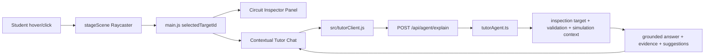

# Circuit Inspector + Tutor Agent Implementation Plan

> **For agentic workers:** REQUIRED SUB-SKILL: Use superpowers:subagent-driven-development (recommended) or superpowers:executing-plans to implement this plan task-by-task. Steps use checkbox (`- [ ]`) syntax for tracking.

**Goal:** 학생이 3D 회로의 부품, 핀, 점퍼선, 전류 흐름을 직접 가리키고 선택하면서, 선택한 대상에 대해 설명을 받고 대화할 수 있는 `Circuit Inspector + Tutor Agent` 경험을 만든다.

**Architecture:** 기존 Vanilla JS + Vite + three.js 구조를 유지한다. 3D scene은 hover/click 가능한 inspection target 이벤트만 내보내고, UI state와 tutor chat orchestration은 `src/main.js`와 새 helper 모듈이 담당한다. 서버는 기존 Deepagents/mock agent 계층을 확장해 선택된 회로 대상, 검증 리포트, render/simulation context를 기반으로 설명 답변을 생성한다.

**Tech Stack:** Vanilla JavaScript, Vite, three.js Raycaster, TypeScript + Zod server schemas, deterministic mock agent, opt-in Deepagents live mode, Playwright E2E.

---

## Current Implementation Status

### 2026-06-01 Current Flow Replay Controls

Scope:

- Added PCB-stage simulation controls for `Show current` / `Pause` and step-by-step current/connection replay.
- Added Korean/English locale keys under `simulationControls`.
- `state.simulationPlaying`, `state.simulationStepIndex`, and `state.selectedCurrentPathId` now track replay state.
- `stepCurrentFlow()` advances through the active circuit connections, selects the current connection in the hardware panel, turns on Run visualization, and exposes the selected flow chip.
- `createStageScene()` now receives `selectedTargetKey` and marks the canvas with `data-selected-target`; selected wires render thicker with stronger emissive intensity.
- Added Playwright coverage proving the controls select `oled-power` then `oled-ground`, update the inspector, and expose the selected stage target.

RED/GREEN verification:

- RED: `npx playwright test tests/e2e/features.spec.js -g "current flow replay controls" --project=desktop-chromium --timeout=50000` failed because `data-testid="simulation-toggle"` did not exist.
- GREEN: the same focused test passed after implementation.

Additional verification:

- `node --test tests/unit/stageScene.test.js tests/unit/i18n.test.js tests/unit/koreanCopy.test.js`: passed, 15 tests.
- Focused PCB/inspector E2E: passed, 4 tests.
- `npm run typecheck`: passed.
- `npm run build`: passed with the existing Vite large chunk warning.
- `npm run check`: passed.
  - JavaScript unit tests: 77 passed.
  - TypeScript unit tests: 138 passed.
  - Playwright E2E: 48 passed, 8 opt-in live tests skipped.

### 2026-06-01 Selected-Target Context Grounding

Scope:

- Added context-layer rules requiring tutor answers to ground selected circuit questions in the active artifact.
- `agent-context/skills/lesson-explanation/SKILL.md` now names `selectedTarget.detail`, `selectedTarget.why`, `selectedTarget.missing`, related connection/current path ids, `validationStatus`, and `validatedCurrentPathIds` as first-class grounding inputs.
- `agent-context/electrical/current-flow-explanations.md` now distinguishes power, ground return, load current, signal activity, and bus activity for selected wires/pins/parts.
- Current-flow explanations are explicitly blocked unless validation is `valid` and the path is backed by validated netlist/current path evidence.
- I2C SDA/SCL and other signal targets must be explained as logic-level communication or logic activity, not as load-current paths.
- Added unit coverage so these context rules cannot silently disappear.

RED/GREEN verification:

- RED: `npm exec -- tsx --test tests/unit/contextLayerStructure.test.ts` failed because `Circuit Inspector Tutor Rules` was missing.
- GREEN: the same focused test passed after context docs were updated.

Additional verification:

- `npm run test:unit`: passed.
  - JavaScript unit tests: 77 passed.
  - TypeScript unit tests: 139 passed.
- `npm exec -- tsx --test tests/unit/contextCoverage.test.ts`: passed, 20 tests.

### 2026-06-01 Keyboard Target Selector And Locale Verification

Scope:

- Added an empty-selection target selector inside the PCB inspector card so students can choose a circuit connection without precise canvas picking.
- The selector exposes `data-testid="inspector-target-selector"` and `data-action="select-target"` buttons with canonical `data-target-id` values such as `connection:oled-sda`.
- Keyboard activation now selects the target, refreshes the inspector rail, updates the selected-flow chip, and records the selected target on the stage canvas without rebuilding the canvas.
- Added Korean/English locale copy for the selector title.
- Extended language-toggle E2E so selected target explanation labels switch between `Why it matters` and `왜 필요한가`.

RED/GREEN verification:

- RED: `npx playwright test tests/e2e/features.spec.js -g "keyboard user can select an inspector target" --project=desktop-chromium --timeout=70000` failed because `inspector-target-selector` did not exist.
- GREEN: the same focused test passed after implementation.

Additional verification:

- `node --test tests/unit/i18n.test.js tests/unit/koreanCopy.test.js`: passed, 5 tests.
- Focused inspector/chat/current-flow E2E: passed, 5 tests.
- `npx playwright test tests/e2e/features.spec.js -g "language toggle preserves a built circuit artifact" --project=desktop-chromium --timeout=90000`: passed.
- `npm run typecheck`: passed.

## Progress Board

- [x] Plan document created: `docs/superpowers/plans/2026-05-31-circuit-inspector-tutor-agent.md`
- [x] Phase 1: Inspectable data contract and static demo inspection catalog
- [ ] Phase 2: 3D hover/click picking and visual highlight
- [ ] Phase 3: PCB tab inspector panel and selected-target explanation UI
- [ ] Phase 4: Contextual tutor chat UI connected to selected target
- [ ] Phase 5: Server `explain` endpoint and deterministic tutor agent
- [ ] Phase 6: Deepagents/context layer integration for live tutor mode
- [x] Phase 7: Current-flow replay controls and explanatory simulation states
- [x] Phase 8: Accessibility, Korean/English localization, responsive polish
- [x] Phase 9: Full acceptance verification through `npm run check`

## Product Thesis

The current product proves that H-eduware can turn a vague student idea into a visible Arduino + OLED circuit. The next product step is to make the circuit inspectable and discussable. A student should not have to infer what a wire means from a static card; the UI should react to the exact part, pin, wire, or current path they are looking at.

The desired student experience is:

1. Student opens the PCB tab.
2. Student hovers over a wire or component.
3. The hovered object highlights in the 3D scene.
4. A compact tooltip names the object and its role.
5. Student clicks the object.
6. The right rail changes from a passive part list into an inspector panel.
7. The inspector explains what the selected object does, why it exists, what happens if it is missing, and how it behaves during simulation.
8. Chat input shows a selected-context chip such as `선택됨: I2C SDA`.
9. Student asks: `이 선이 없으면 어떻게 돼?`
10. Tutor agent answers using only validated circuit context, not hallucinated electronics.

## UX Principles

- **Selection before explanation:** The most relevant explanation is the one attached to what the student is touching.
- **Validated context only:** Current flow explanations must come from validated netlist/simulation data.
- **Small first, deep on demand:** Hover tooltip stays short; click inspector gives structured detail; chat gives follow-up depth.
- **No unsupported certainty:** If a requested explanation requires SPICE-level analog analysis or a component outside the supported context, the agent must state the limit.
- **Korean-first, English-toggle-safe:** New UI copy must be fully present in both `src/locales/ko.js` and `src/locales/en.js`.
- **Inspectable without chat:** A student can learn from hover and inspector even if the server is unavailable.
- **Chat enhances, not blocks:** Tutor chat falls back to deterministic local explanation if `/api/agent/explain` fails.

## Current Codebase Map

Existing files that matter:

- `src/main.js`
  - Owns global UI state, tabs, AI panel, PCB tab, right rail, event binding.
  - Currently passes `circuit` into `createStageScene(host, circuit, { running })`.
  - Needs selected target state, inspector rendering, tutor chat events, and agent client integration.

- `src/stageScene.js`
  - Owns three.js rendering, wires, current dots, pointer drag, wheel zoom.
  - Needs Raycaster hover/click picking and object metadata.

- `src/circuitMetadata.js`
  - Owns deterministic demo circuit, educational connection copy, requirement markdown.
  - Needs richer inspection metadata for parts, pins, connections, and current paths.

- `src/locales/ko.js`, `src/locales/en.js`
  - Own all visible UI copy.
  - Need inspector/tutor/simulation copy.

- `server/agent/schemas.ts`
  - Owns Zod response contracts for agent workflow.
  - Needs tutor explain request/response schemas.

- `server/agent/mockAgent.ts`, `server/agent/deepAgentRuntime.ts`, `server/index.ts`
  - Own agent execution and HTTP endpoints.
  - Need `/api/agent/explain` route and deterministic tutor response.

- `server/agent/circuitTools.ts`
  - Owns validation, netlist, current path, render/simulation plan compilation.
  - Needs explanation helper or target lookup helpers if server-side tutor uses structured context.

- `tests/unit/*.test.js`, `tests/unit/*.test.ts`
  - Need schema, inspector catalog, tutor response, and localization tests.

- `tests/e2e/demo.spec.js`, `tests/e2e/features.spec.js`
  - Need hover/click inspector, selected-context chat, and current-flow controls coverage.

## New File Structure

Create these focused modules:

- `src/circuitInspector.js`
  - Builds a deterministic inspection catalog from `circuit`.
  - Exports `createInspectionCatalog(circuit, locale)`, `findInspectionTarget(catalog, targetId)`, `suggestQuestions(target, locale)`.

- `src/tutorClient.js`
  - Calls `POST /api/agent/explain`.
  - Falls back to local deterministic explanation when server fails.
  - Exports `askTutor({ sessionId, locale, question, selectedTarget, circuit })`.

- `src/tutorFallback.js`
  - Pure local fallback answer generation.
  - No network, no secrets, deterministic tests.

- `server/agent/tutorSchemas.ts`
  - Zod schemas for tutor request and response.

- `server/agent/tutorAgent.ts`
  - Deterministic mock tutor agent and live-mode handoff point.

- `tests/unit/circuitInspector.test.js`
  - Inspection catalog and suggested questions.

- `tests/unit/tutorFallback.test.js`
  - Local fallback answer shape and Korean/English copy.

- `tests/unit/tutorAgent.test.ts`
  - Server request/response schema and deterministic server tutor.

Modify these files:

- `src/main.js`
  - Add `selectedTargetId`, `hoveredTargetId`, `tutorMessages`, `tutorThinking`.
  - Render inspector panel in PCB right rail.
  - Show selected target context in AI/chat panel.
  - Bind suggested question and tutor form submission.

- `src/stageScene.js`
  - Add Raycaster picking.
  - Mark meshes with `userData.inspectTargetId`.
  - Emit `onHoverTarget(targetId | null)` and `onSelectTarget(targetId)`.
  - Highlight hovered/selected meshes.

- `src/styles.css`
  - Add inspector panel, target tooltip, selected context chip, tutor answer states, replay controls.

- `src/locales/ko.js`, `src/locales/en.js`
  - Add `inspector`, `tutor`, `simulationControls` dictionaries.

- `server/index.ts`
  - Add `POST /api/agent/explain`.

- `server/agent/deepAgentRuntime.ts`
  - Export tutor run entrypoint or route through `tutorAgent.ts`.

- `tests/e2e/demo.spec.js`
  - Verify selected circuit target inspector and chat.

- `tests/e2e/features.spec.js`
  - Verify language toggle preserves inspector labels and tutor suggested questions.

## Data Contracts

### Inspectable Target

Each target is an object that can be hovered, selected, explained, and sent to the tutor agent.

```js
{
  id: 'connection:oled-sda',
  kind: 'connection',
  label: 'I2C SDA',
  shortRole: '화면 데이터를 보내는 선',
  detail: 'Arduino A4 핀의 표시 데이터를 OLED SDA 핀으로 보냅니다.',
  why: 'SDA는 I2C 데이터 선이라 화면에 나타날 글자를 전달합니다.',
  missing: '이 선이 빠지면 Arduino가 OLED에 무엇을 그릴지 알려 줄 수 없습니다.',
  relatedComponentIds: ['arduino-uno', 'oled-display'],
  relatedConnectionIds: ['oled-sda'],
  relatedCurrentPathIds: ['oled-i2c-signal'],
  tags: ['i2c', 'signal', 'data'],
  promptHints: [
    '이 선이 없으면 어떻게 돼?',
    'SDA와 SCL은 뭐가 달라?',
    '전류도 이 선으로 흐르나요?'
  ]
}
```

### Tutor Explain Request

```ts
{
  sessionId?: string;
  locale: 'ko' | 'en';
  question: string;
  selectedTargetId: string | null;
  selectedTarget?: InspectableTarget;
  circuitTitle: string;
  validationStatus: 'valid' | 'invalid' | 'valid_with_warnings' | 'unsupported';
  currentPathIds: string[];
}
```

### Tutor Explain Response

```ts
{
  sessionId: string;
  mode: 'mock' | 'live';
  answer: string;
  groundedTargetId: string | null;
  evidence: Array<{
    type: 'target' | 'connection' | 'currentPath' | 'validation' | 'context';
    id: string;
    summary: string;
  }>;
  suggestedQuestions: string[];
  warnings: string[];
}
```

## Target Architecture



---

## Task 1: Inspection Catalog

**Files:**
- Create: `src/circuitInspector.js`
- Modify: `src/locales/ko.js`
- Modify: `src/locales/en.js`
- Test: `tests/unit/circuitInspector.test.js`

- [x] **Step 1: Write failing catalog tests**

Create `tests/unit/circuitInspector.test.js`:

```js
import assert from 'node:assert/strict';
import test from 'node:test';

import { createDemoCircuit } from '../../src/circuitMetadata.js';
import {
  createInspectionCatalog,
  findInspectionTarget,
  suggestQuestions
} from '../../src/circuitInspector.js';

test('inspection catalog exposes parts, pins, and connections for the demo circuit', () => {
  const catalog = createInspectionCatalog(createDemoCircuit('ko'), 'ko');

  assert.ok(catalog.targets.length >= 12);
  assert.ok(findInspectionTarget(catalog, 'part:arduino-uno'));
  assert.ok(findInspectionTarget(catalog, 'part:oled-display'));
  assert.ok(findInspectionTarget(catalog, 'connection:oled-sda'));
  assert.ok(findInspectionTarget(catalog, 'pin:oled-display:SDA'));
});

test('connection target explains role, failure mode, and related current path', () => {
  const catalog = createInspectionCatalog(createDemoCircuit('ko'), 'ko');
  const target = findInspectionTarget(catalog, 'connection:oled-sda');

  assert.equal(target.kind, 'connection');
  assert.equal(target.label, 'I2C SDA');
  assert.match(target.detail, /Arduino/);
  assert.match(target.why, /I2C/);
  assert.match(target.missing, /빠지면/);
  assert.ok(target.relatedConnectionIds.includes('oled-sda'));
});

test('suggested questions are localized and target-aware', () => {
  const koCatalog = createInspectionCatalog(createDemoCircuit('ko'), 'ko');
  const koTarget = findInspectionTarget(koCatalog, 'connection:oled-sda');
  assert.deepEqual(suggestQuestions(koTarget, 'ko').length, 3);
  assert.match(suggestQuestions(koTarget, 'ko').join('\n'), /SDA/);

  const enCatalog = createInspectionCatalog(createDemoCircuit('en'), 'en');
  const enTarget = findInspectionTarget(enCatalog, 'connection:oled-sda');
  assert.match(suggestQuestions(enTarget, 'en').join('\n'), /What happens/i);
});
```

- [x] **Step 2: Run the failing test**

Run:

```powershell
npm run test:unit
```

Expected:

```text
ERR_MODULE_NOT_FOUND ... src/circuitInspector.js
```

- [x] **Step 3: Implement `src/circuitInspector.js`**

Create `src/circuitInspector.js`:

```js
export function createInspectionCatalog(circuit, locale = 'ko') {
  const targets = [];

  for (const part of circuit.parts) {
    targets.push({
      id: `part:${part.id}`,
      kind: 'part',
      label: part.label,
      shortRole: part.description,
      detail: part.description,
      why: locale === 'ko'
        ? `${part.label}은 이 회로에서 ${part.designator || part.type} 역할을 합니다.`
        : `${part.label} acts as ${part.designator || part.type} in this circuit.`,
      missing: locale === 'ko'
        ? `${part.label}이 없으면 이 회로의 해당 기능을 실행할 수 없습니다.`
        : `Without ${part.label}, this circuit cannot perform that function.`,
      relatedComponentIds: [part.id],
      relatedConnectionIds: [],
      relatedCurrentPathIds: [],
      tags: [part.type, part.designator, part.id].filter(Boolean),
      promptHints: locale === 'ko'
        ? [`${part.label}은 어떤 역할이야?`, `이 부품은 왜 필요해?`, `이 부품이 없으면 어떻게 돼?`]
        : [`What does ${part.label} do?`, `Why is this part needed?`, `What happens without this part?`]
    });

    for (const pin of part.pins || []) {
      targets.push({
        id: `pin:${part.id}:${pin.name}`,
        kind: 'pin',
        label: `${part.label} ${pin.name}`,
        shortRole: pin.meaning || pin.role,
        detail: pin.meaning || pin.role,
        why: locale === 'ko'
          ? `${pin.name} 핀은 ${pin.role} 역할을 합니다.`
          : `The ${pin.name} pin provides the ${pin.role} role.`,
        missing: locale === 'ko'
          ? `${pin.name} 핀이 연결되지 않으면 관련 신호나 전원 경로가 끊깁니다.`
          : `If ${pin.name} is not connected, the related signal or power path is broken.`,
        relatedComponentIds: [part.id],
        relatedConnectionIds: circuit.connections
          .filter((connection) => endpointMatches(connection.from, part.id, pin.name) || endpointMatches(connection.to, part.id, pin.name))
          .map((connection) => connection.id),
        relatedCurrentPathIds: [],
        tags: [part.type, pin.role, pin.name],
        promptHints: locale === 'ko'
          ? [`${pin.name} 핀은 왜 필요해?`, `이 핀에는 어떤 신호가 지나가?`, `잘못 연결하면 어떻게 돼?`]
          : [`Why is the ${pin.name} pin needed?`, `What signal goes through this pin?`, `What if it is wired incorrectly?`]
      });
    }
  }

  for (const connection of circuit.connections) {
    targets.push({
      id: `connection:${connection.id}`,
      kind: 'connection',
      label: connection.education.label,
      shortRole: connection.education.title,
      detail: connection.education.what,
      why: connection.education.why,
      missing: connection.education.missing,
      relatedComponentIds: [connection.from.partId, connection.to.partId],
      relatedConnectionIds: [connection.id],
      relatedCurrentPathIds: [currentPathIdForConnection(connection)],
      tags: [connection.signal, connection.education.label, connection.id],
      promptHints: locale === 'ko'
        ? [
            `${connection.education.label}은 왜 필요해?`,
            `이 선이 없으면 어떻게 돼?`,
            `이 선에는 전류가 어떻게 흘러?`
          ]
        : [
            `Why is ${connection.education.label} needed?`,
            `What happens if this wire is missing?`,
            `How does current or signal move here?`
          ]
    });
  }

  return { circuitTitle: circuit.title, targets };
}

export function findInspectionTarget(catalog, targetId) {
  return catalog.targets.find((target) => target.id === targetId) || null;
}

export function suggestQuestions(target, locale = 'ko') {
  if (!target) {
    return locale === 'ko'
      ? ['이 회로는 어떻게 동작해?', '전류는 어디로 흘러?', '어떤 부품부터 보면 좋아?']
      : ['How does this circuit work?', 'Where does current flow?', 'Which part should I inspect first?'];
  }
  return target.promptHints.slice(0, 3);
}

function endpointMatches(endpoint, partId, pinName) {
  return endpoint.partId === partId && endpoint.pin === pinName;
}

function currentPathIdForConnection(connection) {
  if (connection.signal === 'power') return 'oled-power-path';
  if (connection.signal === 'ground') return 'oled-ground-return';
  if (connection.signal === 'i2c-data') return 'oled-i2c-data';
  if (connection.signal === 'i2c-clock') return 'oled-i2c-clock';
  return `${connection.id}-path`;
}
```

- [x] **Step 4: Run unit tests**

Run:

```powershell
npm run test:unit
```

Expected:

```text
# pass ... circuitInspector.test.js
```

- [x] **Step 5: Mark progress in this document**

Update Progress Board:

```markdown
- [x] Phase 1: Inspectable data contract and static demo inspection catalog
```

## Task 2: Stage Scene Hover and Click Picking

**Files:**
- Modify: `src/stageScene.js`
- Modify: `src/main.js`
- Test: `tests/e2e/features.spec.js`

- [ ] **Step 1: Add E2E test for canvas selection**

Append to `tests/e2e/features.spec.js`:

```js
test('student can click a circuit wire and open the inspector context', async ({ page }) => {
  const guards = attachGuards(page);

  await page.goto('/');
  await page.getByTestId('welcome-dismiss').click();
  await page.getByRole('button', { name: '데모', exact: true }).click();
  await page.getByRole('tab', { name: '회로' }).click();

  const canvas = page.getByTestId('stage-canvas');
  await expect(canvas).toBeVisible();
  await canvas.click({ position: { x: 520, y: 360 } });

  await expect(page.getByTestId('circuit-inspector')).toBeVisible();
  await expect(page.getByTestId('selected-target-chip')).toBeVisible();
  await expect(page.getByTestId('inspector-suggested-question').first()).toBeVisible();

  assertClean(guards);
});
```

Expected first failure can be either missing `circuit-inspector` or no selected target.

- [ ] **Step 2: Extend `createStageScene` options**

Modify the function signature behavior in `src/stageScene.js`:

```js
export function createStageScene(container, circuit, options = {}) {
  const canvas = document.createElement('canvas');
  canvas.dataset.testid = 'stage-canvas';
  canvas.className = 'stage-canvas';
  container.append(canvas);

  try {
    return createThreeScene(container, canvas, circuit, options);
  } catch (error) {
    return createCanvasFallback(container, canvas, circuit, options);
  }
}
```

Keep the signature but use these new option keys inside `createThreeScene`:

```js
const onHoverTarget = typeof options.onHoverTarget === 'function' ? options.onHoverTarget : () => {};
const onSelectTarget = typeof options.onSelectTarget === 'function' ? options.onSelectTarget : () => {};
const selectedTargetId = options.selectedTargetId || null;
```

- [ ] **Step 3: Attach inspect target metadata to meshes**

Inside `addArduino`, after creating the Arduino board mesh:

```js
board.userData.inspectTargetId = 'part:arduino-uno';
```

Inside `addOled`, after creating the OLED board mesh:

```js
board.userData.inspectTargetId = 'part:oled-display';
screen.userData.inspectTargetId = 'part:oled-display';
```

Inside `addWires`, after creating each wire mesh:

```js
wire.userData.inspectTargetId = `connection:${connection.id}`;
```

Inside `addWireConnector`, accept a `targetId` parameter and set:

```js
ferrule.userData.inspectTargetId = targetId;
boot.userData.inspectTargetId = targetId;
```

Call it from `addWires`:

```js
const targetId = `connection:${connection.id}`;
addWireConnector(root, from, connection.color, stats, targetId);
addWireConnector(root, to, connection.color, stats, targetId);
```

- [ ] **Step 4: Add Raycaster event handling**

Inside `createThreeScene`, after pointer state variables:

```js
const raycaster = new THREE.Raycaster();
const pointer = new THREE.Vector2();
let hoveredTargetId = null;

canvas.addEventListener('pointermove', (event) => {
  if (dragging) {
    targetRotation += (event.clientX - lastX) * 0.006;
    lastX = event.clientX;
    return;
  }
  const targetId = pickTarget(event);
  if (targetId !== hoveredTargetId) {
    hoveredTargetId = targetId;
    canvas.dataset.hoverTargetId = targetId || '';
    onHoverTarget(targetId);
  }
});

canvas.addEventListener('click', (event) => {
  const targetId = pickTarget(event);
  if (targetId) {
    canvas.dataset.selectedTargetId = targetId;
    onSelectTarget(targetId);
  }
});

function pickTarget(event) {
  const rect = canvas.getBoundingClientRect();
  pointer.x = ((event.clientX - rect.left) / rect.width) * 2 - 1;
  pointer.y = -(((event.clientY - rect.top) / rect.height) * 2 - 1);
  raycaster.setFromCamera(pointer, camera);
  const hits = raycaster.intersectObjects(root.children, true);
  const hit = hits.find((entry) => entry.object.userData.inspectTargetId);
  return hit?.object.userData.inspectTargetId || null;
}
```

- [ ] **Step 5: Pass stage callbacks from `src/main.js`**

Replace the `createStageScene` call:

```js
stageController = createStageScene(host, circuit, {
  running: state.running,
  selectedTargetId: state.selectedTargetId,
  onHoverTarget(targetId) {
    state.hoveredTargetId = targetId;
  },
  onSelectTarget(targetId) {
    state.selectedTargetId = targetId;
    render();
  }
});
```

Add to initial `state`:

```js
selectedTargetId: null,
hoveredTargetId: null,
```

- [ ] **Step 6: Run focused E2E**

Run:

```powershell
npm run test:e2e -- --grep "click a circuit wire"
```

Expected after Task 3 UI work:

```text
1 passed
```

This task may still fail until Task 3 creates `circuit-inspector`; that is acceptable if the picker data attributes change when clicking.

## Task 3: Circuit Inspector Panel

**Files:**
- Modify: `src/main.js`
- Modify: `src/styles.css`
- Modify: `src/locales/ko.js`
- Modify: `src/locales/en.js`
- Test: `tests/unit/i18n.test.js`
- Test: `tests/e2e/demo.spec.js`

- [ ] **Step 1: Add locale keys**

Add to `src/locales/ko.js`:

```js
inspector: {
  kicker: '회로 인스펙터',
  emptyTitle: '회로 위의 부품이나 선을 선택해 보세요',
  emptyBody: '선택한 대상의 역할, 동작, 빠졌을 때의 문제를 여기에서 설명합니다.',
  selected: '선택됨',
  role: '역할',
  why: '왜 필요한가',
  missing: '빠지면 생기는 일',
  related: '관련 대상',
  suggested: '추천 질문'
}
```

Add to `src/locales/en.js`:

```js
inspector: {
  kicker: 'Circuit inspector',
  emptyTitle: 'Select a part or wire on the circuit',
  emptyBody: 'This panel explains the selected target, how it behaves, and what breaks if it is missing.',
  selected: 'Selected',
  role: 'Role',
  why: 'Why it matters',
  missing: 'If it is missing',
  related: 'Related targets',
  suggested: 'Suggested questions'
}
```

- [ ] **Step 2: Add i18n coverage**

Modify `tests/unit/i18n.test.js`:

```js
assert.equal(t('inspector.kicker'), '회로 인스펙터');
assert.equal(t('inspector.kicker', {}, 'en'), 'Circuit inspector');
```

- [ ] **Step 3: Import inspection helpers**

In `src/main.js`:

```js
import {
  createInspectionCatalog,
  findInspectionTarget,
  suggestQuestions
} from './circuitInspector.js';
```

Add helpers:

```js
function activeInspectionCatalog() {
  return createInspectionCatalog(activeCircuit(), state.locale);
}

function selectedInspectionTarget() {
  return findInspectionTarget(activeInspectionCatalog(), state.selectedTargetId);
}
```

- [ ] **Step 4: Replace PCB right rail with inspector-first rail**

Modify `renderRightRail()`:

```js
function renderRightRail() {
  if (state.activeTab === 'PCB' && state.projectLoaded) {
    return renderCircuitInspector();
  }

  return renderFileExplorer();
}
```

Add:

```js
function renderCircuitInspector() {
  const target = selectedInspectionTarget();

  if (!target) {
    return `
      <aside class="right-rail inspector-rail" data-testid="circuit-inspector">
        <div class="rail-header">
          <div class="panel-kicker">${t('inspector.kicker', {}, state.locale)}</div>
          <h2>${t('inspector.emptyTitle', {}, state.locale)}</h2>
        </div>
        <p class="inspector-empty">${t('inspector.emptyBody', {}, state.locale)}</p>
        ${renderPartLibrary()}
      </aside>
    `;
  }

  return `
    <aside class="right-rail inspector-rail" data-testid="circuit-inspector">
      <div class="rail-header">
        <div class="panel-kicker">${t('inspector.kicker', {}, state.locale)}</div>
        <h2>${escapeHtml(target.label)}</h2>
      </div>
      <div class="selected-target-chip" data-testid="selected-target-chip">
        <span>${t('inspector.selected', {}, state.locale)}</span>
        <strong>${escapeHtml(target.label)}</strong>
      </div>
      ${renderInspectorSection(t('inspector.role', {}, state.locale), target.detail)}
      ${renderInspectorSection(t('inspector.why', {}, state.locale), target.why)}
      ${renderInspectorSection(t('inspector.missing', {}, state.locale), target.missing)}
      <div class="inspector-suggestions">
        <div class="panel-kicker">${t('inspector.suggested', {}, state.locale)}</div>
        ${suggestQuestions(target, state.locale).map((question) => `
          <button type="button" data-action="ask-suggested" data-question="${escapeHtml(question)}" data-testid="inspector-suggested-question">${escapeHtml(question)}</button>
        `).join('')}
      </div>
    </aside>
  `;
}

function renderInspectorSection(title, body) {
  return `
    <section class="inspector-section">
      <h3>${escapeHtml(title)}</h3>
      <p>${escapeHtml(body)}</p>
    </section>
  `;
}
```

If nesting `renderPartLibrary()` inside an `aside` creates invalid nested rail markup, split the existing part library into `renderCompactPartLibrary()` before applying this exact shape.

- [ ] **Step 5: Add styles**

Append to `src/styles.css`:

```css
.inspector-rail {
  gap: 18px;
}

.inspector-empty {
  margin: 0;
  color: var(--c-muted);
  line-height: 1.5;
}

.selected-target-chip {
  display: grid;
  gap: 4px;
  border: 1px solid var(--c-hairline);
  border-radius: 8px;
  padding: 12px;
  background: #f8f7f4;
}

.selected-target-chip span,
.inspector-section h3 {
  margin: 0;
  color: var(--c-muted);
  font-family: "Space Mono", ui-monospace, monospace;
  font-size: 12px;
  text-transform: uppercase;
}

.selected-target-chip strong {
  font-size: 16px;
}

.inspector-section {
  display: grid;
  gap: 7px;
  border-top: 1px solid var(--c-card-border);
  padding-top: 14px;
}

.inspector-section p {
  margin: 0;
  line-height: 1.48;
}

.inspector-suggestions {
  display: grid;
  gap: 8px;
  border-top: 1px solid var(--c-hairline);
  padding-top: 16px;
}

.inspector-suggestions button {
  border: 1px solid var(--c-hairline);
  border-radius: 8px;
  padding: 10px 12px;
  background: var(--c-canvas);
  color: var(--c-ink);
  text-align: left;
}
```

- [ ] **Step 6: Run tests**

Run:

```powershell
npm run test:unit
npm run test:e2e -- --grep "click a circuit wire"
```

Expected:

```text
unit passes
click inspector test passes
```

## Task 4: Contextual Tutor Chat UI

**Files:**
- Modify: `src/main.js`
- Modify: `src/styles.css`
- Modify: `src/locales/ko.js`
- Modify: `src/locales/en.js`
- Test: `tests/e2e/features.spec.js`

- [ ] **Step 1: Add tutor chat state**

Add to `state` in `src/main.js`:

```js
tutorMessages: [],
tutorThinking: false,
tutorSessionId: null,
```

- [ ] **Step 2: Add locale keys**

Add to Korean locale:

```js
tutor: {
  contextPrefix: '선택됨',
  askLabel: '선택한 회로에 대해 질문하기',
  askPlaceholder: '예: 이 선이 없으면 어떻게 돼?',
  send: '질문하기',
  fallbackIntro: '검증된 회로 정보를 기준으로 설명할게요.',
  noSelection: '먼저 회로의 부품이나 선을 선택하면 더 정확하게 설명할 수 있어요.'
}
```

Add to English locale:

```js
tutor: {
  contextPrefix: 'Selected',
  askLabel: 'Ask about the selected circuit target',
  askPlaceholder: 'Example: What happens if this wire is missing?',
  send: 'Ask',
  fallbackIntro: 'I will explain using the validated circuit information.',
  noSelection: 'Select a part or wire first for a more precise explanation.'
}
```

- [ ] **Step 3: Render selected context chip in AI panel**

Inside `renderAiPanel()`, before `.thread`:

```js
${renderTutorContextChip()}
```

Add:

```js
function renderTutorContextChip() {
  const target = selectedInspectionTarget();
  if (!target) return '';
  return `
    <div class="tutor-context-chip" data-testid="tutor-context-chip">
      <span>${t('tutor.contextPrefix', {}, state.locale)}</span>
      <strong>${escapeHtml(target.label)}</strong>
    </div>
  `;
}
```

- [ ] **Step 4: Render tutor messages below normal thread**

Inside `renderAiPanel()`, after existing `thread`:

```js
${renderTutorThread()}
```

Add:

```js
function renderTutorThread() {
  if (!state.tutorMessages.length && !state.tutorThinking) {
    return '';
  }

  return `
    <div class="tutor-thread" data-testid="tutor-thread">
      ${state.tutorMessages.map((message) => `
        <article class="message ${escapeHtml(message.role)}">
          <span>${message.role === 'student' ? t('roles.student', {}, state.locale) : t('roles.assistant', {}, state.locale)}</span>
          <p>${escapeHtml(message.text)}</p>
        </article>
      `).join('')}
      ${state.tutorThinking ? renderTypingIndicator() : ''}
    </div>
  `;
}
```

- [ ] **Step 5: Add tutor form**

Inside `renderAiPanel()`, below original idea form or replace label dynamically when `state.selectedTargetId` exists:

```js
${state.projectLoaded && state.activeTab === 'PCB' ? `
  <form class="tutor-form" data-action="ask-tutor">
    <label for="tutor-input">${t('tutor.askLabel', {}, state.locale)}</label>
    <textarea id="tutor-input" name="question" rows="2" placeholder="${t('tutor.askPlaceholder', {}, state.locale)}"></textarea>
    <button class="light-action" type="submit">${t('tutor.send', {}, state.locale)}</button>
  </form>
` : ''}
```

- [ ] **Step 6: Bind suggested questions and tutor form**

In `bindEvents()`:

```js
app.querySelectorAll('[data-action="ask-suggested"]').forEach((button) => {
  button.addEventListener('click', () => askTutorQuestion(button.dataset.question));
});

const tutorForm = app.querySelector('[data-action="ask-tutor"]');
tutorForm?.addEventListener('submit', (event) => {
  event.preventDefault();
  const question = new FormData(tutorForm).get('question')?.toString().trim();
  if (question) askTutorQuestion(question);
});
```

Add temporary local function before Task 5:

```js
function askTutorQuestion(question) {
  const target = selectedInspectionTarget();
  const answer = target
    ? `${t('tutor.fallbackIntro', {}, state.locale)} ${target.why} ${target.missing}`
    : t('tutor.noSelection', {}, state.locale);

  state.tutorMessages = state.tutorMessages.concat(
    { role: 'student', text: question },
    { role: 'assistant', text: answer }
  );
  render();
}
```

- [ ] **Step 7: Add E2E test for contextual chat**

Append to `tests/e2e/features.spec.js`:

```js
test('student can ask a selected circuit target question', async ({ page }) => {
  const guards = attachGuards(page);

  await page.goto('/');
  await page.getByTestId('welcome-dismiss').click();
  await page.getByRole('button', { name: '데모', exact: true }).click();
  await page.getByRole('tab', { name: '회로' }).click();
  await page.getByTestId('stage-canvas').click({ position: { x: 520, y: 360 } });
  await page.getByTestId('inspector-suggested-question').first().click();

  await expect(page.getByTestId('tutor-thread')).toBeVisible();
  await expect(page.getByTestId('tutor-thread')).toContainText(/검증된 회로|기준/);

  assertClean(guards);
});
```

- [ ] **Step 8: Run E2E focused**

Run:

```powershell
npm run test:e2e -- --grep "selected circuit target question"
```

Expected:

```text
1 passed
```

## Task 5: Server Tutor Agent Endpoint

**Files:**
- Create: `server/agent/tutorSchemas.ts`
- Create: `server/agent/tutorAgent.ts`
- Modify: `server/index.ts`
- Create: `tests/unit/tutorAgent.test.ts`

- [ ] **Step 1: Write server tutor tests**

Create `tests/unit/tutorAgent.test.ts`:

```ts
import assert from 'node:assert/strict';
import test from 'node:test';

import { TutorExplainRequestSchema, TutorExplainResponseSchema } from '../../server/agent/tutorSchemas.ts';
import { runTutorAgent } from '../../server/agent/tutorAgent.ts';

test('tutor request schema accepts selected circuit context', () => {
  const parsed = TutorExplainRequestSchema.parse({
    locale: 'ko',
    question: '이 선이 없으면 어떻게 돼?',
    selectedTargetId: 'connection:oled-sda',
    selectedTarget: {
      id: 'connection:oled-sda',
      kind: 'connection',
      label: 'I2C SDA',
      detail: 'Arduino A4에서 OLED SDA로 데이터를 보냅니다.',
      why: '화면 글자를 전달합니다.',
      missing: '빠지면 화면을 갱신할 수 없습니다.'
    },
    circuitTitle: 'Arduino OLED 이름 표시',
    validationStatus: 'valid',
    currentPathIds: ['oled-i2c-data']
  });

  assert.equal(parsed.selectedTargetId, 'connection:oled-sda');
});

test('mock tutor answer is grounded and returns evidence', async () => {
  const response = await runTutorAgent({
    locale: 'ko',
    question: '이 선이 없으면 어떻게 돼?',
    selectedTargetId: 'connection:oled-sda',
    selectedTarget: {
      id: 'connection:oled-sda',
      kind: 'connection',
      label: 'I2C SDA',
      detail: 'Arduino A4에서 OLED SDA로 데이터를 보냅니다.',
      why: '화면 글자를 전달합니다.',
      missing: '빠지면 화면을 갱신할 수 없습니다.'
    },
    circuitTitle: 'Arduino OLED 이름 표시',
    validationStatus: 'valid',
    currentPathIds: ['oled-i2c-data']
  });

  const parsed = TutorExplainResponseSchema.parse(response);
  assert.equal(parsed.mode, 'mock');
  assert.equal(parsed.groundedTargetId, 'connection:oled-sda');
  assert.match(parsed.answer, /I2C SDA/);
  assert.ok(parsed.evidence.some((item) => item.type === 'target'));
});
```

- [ ] **Step 2: Implement schemas**

Create `server/agent/tutorSchemas.ts`:

```ts
import { z } from 'zod';

export const TutorSelectedTargetSchema = z.object({
  id: z.string().min(1),
  kind: z.enum(['part', 'pin', 'connection', 'currentPath']),
  label: z.string().min(1),
  detail: z.string().default(''),
  why: z.string().default(''),
  missing: z.string().default('')
});

export const TutorExplainRequestSchema = z.object({
  sessionId: z.string().optional(),
  locale: z.enum(['ko', 'en']).default('ko'),
  question: z.string().min(1),
  selectedTargetId: z.string().nullable().default(null),
  selectedTarget: TutorSelectedTargetSchema.optional(),
  circuitTitle: z.string().min(1),
  validationStatus: z.enum(['valid', 'invalid', 'valid_with_warnings', 'unsupported']),
  currentPathIds: z.array(z.string()).default([])
});

export const TutorExplainResponseSchema = z.object({
  sessionId: z.string().min(1),
  mode: z.enum(['mock', 'live']),
  answer: z.string().min(1),
  groundedTargetId: z.string().nullable(),
  evidence: z.array(z.object({
    type: z.enum(['target', 'connection', 'currentPath', 'validation', 'context']),
    id: z.string(),
    summary: z.string()
  })),
  suggestedQuestions: z.array(z.string()),
  warnings: z.array(z.string())
});

export type TutorExplainRequest = z.infer<typeof TutorExplainRequestSchema>;
export type TutorExplainResponse = z.infer<typeof TutorExplainResponseSchema>;
```

- [ ] **Step 3: Implement deterministic tutor agent**

Create `server/agent/tutorAgent.ts`:

```ts
import { randomUUID } from 'node:crypto';
import {
  TutorExplainRequestSchema,
  TutorExplainResponseSchema,
  type TutorExplainRequest,
  type TutorExplainResponse
} from './tutorSchemas.ts';

export async function runTutorAgent(input: TutorExplainRequest): Promise<TutorExplainResponse> {
  const request = TutorExplainRequestSchema.parse(input);
  const target = request.selectedTarget;
  const locale = request.locale;

  const answer = target
    ? locale === 'ko'
      ? `${target.label}에 대해 설명할게요. ${target.detail} ${target.why} ${target.missing}`
      : `Here is ${target.label}. ${target.detail} ${target.why} ${target.missing}`
    : locale === 'ko'
      ? '먼저 회로의 부품, 핀, 선 중 하나를 선택하면 더 정확하게 설명할 수 있어요.'
      : 'Select a part, pin, or wire first so I can explain the exact circuit target.';

  return TutorExplainResponseSchema.parse({
    sessionId: request.sessionId || randomUUID(),
    mode: 'mock',
    answer,
    groundedTargetId: target?.id || null,
    evidence: target
      ? [
          { type: 'target', id: target.id, summary: target.label },
          { type: 'validation', id: request.validationStatus, summary: request.validationStatus }
        ]
      : [{ type: 'context', id: request.circuitTitle, summary: request.circuitTitle }],
    suggestedQuestions: locale === 'ko'
      ? ['전류는 어디로 흘러?', '이 연결이 틀리면 어떻게 돼?', '다음에는 어떤 부품을 보면 좋아?']
      : ['Where does current flow?', 'What if this is wired incorrectly?', 'Which part should I inspect next?'],
    warnings: request.validationStatus === 'valid' ? [] : [`validation:${request.validationStatus}`]
  });
}
```

- [ ] **Step 4: Add HTTP route**

Modify `server/index.ts` to import:

```ts
import { TutorExplainRequestSchema } from './agent/tutorSchemas.ts';
import { runTutorAgent } from './agent/tutorAgent.ts';
```

Add route before 404:

```ts
if (request.method === 'POST' && request.url === '/api/agent/explain') {
  const body = await readJson(request);
  const parsed = TutorExplainRequestSchema.parse(body);
  const result = await runTutorAgent(parsed);
  sendJson(response, 200, result);
  return;
}
```

- [ ] **Step 5: Run server unit tests**

Run:

```powershell
npm run test:unit
```

Expected:

```text
tutorAgent.test.ts passes
```

## Task 6: Frontend Tutor Client

**Files:**
- Create: `src/tutorFallback.js`
- Create: `src/tutorClient.js`
- Modify: `src/main.js`
- Test: `tests/unit/tutorFallback.test.js`

- [ ] **Step 1: Write fallback tests**

Create `tests/unit/tutorFallback.test.js`:

```js
import assert from 'node:assert/strict';
import test from 'node:test';

import { createTutorFallbackAnswer } from '../../src/tutorFallback.js';

test('fallback tutor answer uses selected target context in Korean', () => {
  const answer = createTutorFallbackAnswer({
    locale: 'ko',
    question: '이 선이 없으면 어떻게 돼?',
    selectedTarget: {
      label: 'I2C SDA',
      detail: '데이터를 보냅니다.',
      why: '화면 글자를 전달합니다.',
      missing: '빠지면 화면이 갱신되지 않습니다.'
    }
  });

  assert.match(answer.answer, /I2C SDA/);
  assert.match(answer.answer, /빠지면/);
  assert.equal(answer.mode, 'mock');
});
```

- [ ] **Step 2: Implement fallback**

Create `src/tutorFallback.js`:

```js
export function createTutorFallbackAnswer({ locale = 'ko', selectedTarget }) {
  if (!selectedTarget) {
    return {
      mode: 'mock',
      answer: locale === 'ko'
        ? '먼저 회로의 부품이나 선을 선택하면 더 정확하게 설명할 수 있어요.'
        : 'Select a part or wire first for a more precise explanation.',
      evidence: [],
      suggestedQuestions: [],
      warnings: []
    };
  }

  return {
    mode: 'mock',
    answer: locale === 'ko'
      ? `${selectedTarget.label}에 대해 설명할게요. ${selectedTarget.detail} ${selectedTarget.why} ${selectedTarget.missing}`
      : `Here is ${selectedTarget.label}. ${selectedTarget.detail} ${selectedTarget.why} ${selectedTarget.missing}`,
    evidence: [{ type: 'target', id: selectedTarget.id || selectedTarget.label, summary: selectedTarget.label }],
    suggestedQuestions: selectedTarget.promptHints || [],
    warnings: []
  };
}
```

- [ ] **Step 3: Implement client**

Create `src/tutorClient.js`:

```js
import { createTutorFallbackAnswer } from './tutorFallback.js';

export async function askTutor(payload) {
  try {
    const response = await fetch('/api/agent/explain', {
      method: 'POST',
      headers: { 'Content-Type': 'application/json' },
      body: JSON.stringify(payload)
    });
    if (!response.ok) {
      throw new Error(`Tutor request failed: ${response.status}`);
    }
    return await response.json();
  } catch (error) {
    return createTutorFallbackAnswer(payload);
  }
}
```

- [ ] **Step 4: Wire client in `src/main.js`**

Import:

```js
import { askTutor } from './tutorClient.js';
```

Replace temporary `askTutorQuestion` with:

```js
async function askTutorQuestion(question) {
  const target = selectedInspectionTarget();
  state.tutorMessages = state.tutorMessages.concat({ role: 'student', text: question });
  state.tutorThinking = true;
  render();

  const response = await askTutor({
    sessionId: state.tutorSessionId,
    locale: state.locale,
    question,
    selectedTargetId: target?.id || null,
    selectedTarget: target || undefined,
    circuitTitle: activeCircuit().title,
    validationStatus: 'valid',
    currentPathIds: target?.relatedCurrentPathIds || []
  });

  state.tutorSessionId = response.sessionId || state.tutorSessionId;
  state.tutorThinking = false;
  state.tutorMessages = state.tutorMessages.concat({ role: 'assistant', text: response.answer });
  render();
}
```

- [ ] **Step 5: Run verification**

Run:

```powershell
npm run test:unit
npm run test:e2e -- --grep "selected circuit target question"
```

Expected:

```text
unit passes
E2E passes with server offline because tutorClient falls back locally
```

## Task 7: Current Flow Replay Controls

**Files:**
- Modify: `src/main.js`
- Modify: `src/stageScene.js`
- Modify: `src/styles.css`
- Modify: `src/locales/ko.js`
- Modify: `src/locales/en.js`
- Test: `tests/e2e/demo.spec.js`

- [x] **Step 1: Add simulation control locale keys**

Korean:

```js
simulationControls: {
  play: '전류 보기',
  pause: '일시정지',
  step: '한 단계씩 보기',
  speed: '속도',
  selectedPath: '선택된 흐름'
}
```

English:

```js
simulationControls: {
  play: 'Show current',
  pause: 'Pause',
  step: 'Step through',
  speed: 'Speed',
  selectedPath: 'Selected flow'
}
```

- [x] **Step 2: Add state**

In `src/main.js`:

```js
simulationPlaying: false,
simulationStepIndex: 0,
simulationSpeed: 1,
selectedCurrentPathId: null,
```

- [x] **Step 3: Render controls in PCB toolbar**

Extend `renderPcbTab()` toolbar:

```js
<button type="button" data-action="toggle-simulation">
  ${state.simulationPlaying ? t('simulationControls.pause', {}, state.locale) : t('simulationControls.play', {}, state.locale)}
</button>
<button type="button" data-action="step-simulation">${t('simulationControls.step', {}, state.locale)}</button>
```

- [x] **Step 4: Bind controls**

In `bindEvents()`:

```js
app.querySelector('[data-action="toggle-simulation"]')?.addEventListener('click', () => {
  state.simulationPlaying = !state.simulationPlaying;
  state.running = state.simulationPlaying;
  render();
});

app.querySelector('[data-action="step-simulation"]')?.addEventListener('click', () => {
  state.simulationStepIndex = (state.simulationStepIndex + 1) % activeCircuit().connections.length;
  state.selectedTargetId = `connection:${activeCircuit().connections[state.simulationStepIndex].id}`;
  state.running = true;
  render();
});
```

- [x] **Step 5: Highlight selected path in stage**

In `stageScene.js`, when building each wire material:

```js
const targetId = `connection:${connection.id}`;
const isSelected = selectedTargetId === targetId;
const wire = new THREE.Mesh(
  new THREE.TubeGeometry(curve, 56, isSelected ? 0.046 : 0.032, 12),
  new THREE.MeshStandardMaterial({
    color: connection.color,
    roughness: 0.34,
    metalness: 0.05,
    emissive: connection.color,
    emissiveIntensity: isSelected ? 0.65 : 0.12
  })
);
```

- [x] **Step 6: Add E2E check**

In `tests/e2e/demo.spec.js`, after PCB tab opens:

```js
await page.getByRole('button', { name: '전류 보기' }).click();
await expect(page.getByTestId('oled-output')).toContainText(/READY|RALPHTON BUSAN|준비됨/);
await page.getByRole('button', { name: '한 단계씩 보기' }).click();
await expect(page.getByTestId('selected-target-chip')).toBeVisible();
```

- [x] **Step 7: Run E2E**

Run:

```powershell
npm run test:e2e
```

Expected:

```text
20+ tests passed
```

## Task 8: Deepagents Context Integration

**Files:**
- Modify: `agent-context/skills/lesson-explanation/SKILL.md`
- Modify: `agent-context/electrical/current-flow-explanations.md`
- Existing live guard: `server/agent/circuitTutor.ts`
- Modify: `server/agent/deepAgentRuntime.ts`
- Test: `tests/unit/contextLayerStructure.test.ts`
- Test: `tests/unit/circuitTutor.test.ts`

- [x] **Step 1: Update explanation skill**

Add this rule to `agent-context/skills/lesson-explanation/SKILL.md`:

```md
## Circuit Inspector Tutor Rules

- When a selectedTarget is provided, answer primarily from selectedTarget.detail, selectedTarget.why, selectedTarget.missing, relatedConnectionIds, relatedCurrentPathIds, validationStatus, validatedCurrentPathIds, and simulation plan current path ids.
- Do not describe current flow unless validationStatus is `valid` and the current path is present in validatedCurrentPathIds or simulation plan current path ids.
- If the question asks for a missing component, wiring fault, overcurrent, or short circuit, explain the failure as a learning outcome and include the safest correction.
- If the selected target is a signal connection such as SDA, SCL, PWM, or GPIO control, distinguish signal communication or logic activity from load current.
```

- [x] **Step 2: Update current-flow reference**

Add to `agent-context/electrical/current-flow-explanations.md`:

```md
## Inspector Conversation Grounding

For a selected wire, pin, or part:

1. Identify whether it carries power, ground return, load current, signal activity, or bus activity.
2. Explain whether steady-state load current is expected through it.
3. For I2C signal lines such as SDA and SCL, describe logic-level communication rather than treating the wire as a power path.
4. Reference the validated netlist and validated current path ids before presenting a current path.
5. If validation status is not valid, do not animate or assert current flow; explain the blocker instead.
```

- [x] **Step 3: Live tutor mode guard**

Implemented in `server/agent/circuitTutor.ts`:

```ts
function shouldUseLiveTutor() {
  return process.env.H_EDUWARE_TUTOR_MODE === 'live';
}
```

Use mock path by default. Live mode can be added behind this guard without breaking deterministic tests.

- [x] **Step 4: Add tests**

In `tests/unit/contextLayerStructure.test.ts`, assert the new strings exist:

```ts
assert.match(await readContextFile('skills/lesson-explanation/SKILL.md'), /Circuit Inspector Tutor Rules/);
assert.match(await readContextFile('electrical/current-flow-explanations.md'), /Inspector Conversation Grounding/);
```

- [x] **Step 5: Run tests**

Run:

```powershell
npm exec -- tsx --test tests/unit/contextLayerStructure.test.ts
npm exec -- tsx --test tests/unit/contextCoverage.test.ts
npm run test:unit
```

Expected:

```text
context layer tests pass
tutor agent tests pass in mock mode
```

## Task 9: Korean/English UX Polish and Accessibility

**Files:**
- Modify: `src/main.js`
- Modify: `src/styles.css`
- Modify: `tests/e2e/features.spec.js`

- [x] **Step 1: Keyboard selectable inspector targets**

Add a visible list of selectable targets in inspector empty state:

```js
const catalog = activeInspectionCatalog();
${catalog.targets.filter((target) => target.kind === 'connection').map((target) => `
  <button type="button" data-action="select-target" data-target-id="${escapeHtml(target.id)}">
    ${escapeHtml(target.label)}
  </button>
`).join('')}
```

Bind:

```js
app.querySelectorAll('[data-action="select-target"]').forEach((button) => {
  button.addEventListener('click', () => {
    state.selectedTargetId = button.dataset.targetId;
    render();
  });
});
```

- [x] **Step 2: Add E2E keyboard path**

Append:

```js
test('keyboard user can select a circuit connection without canvas picking', async ({ page }) => {
  const guards = attachGuards(page);
  await page.goto('/');
  await page.getByTestId('welcome-dismiss').click();
  await page.getByRole('button', { name: '데모', exact: true }).click();
  await page.getByRole('tab', { name: '회로' }).click();

  await page.getByRole('button', { name: 'I2C SDA' }).click();
  await expect(page.getByTestId('selected-target-chip')).toContainText('I2C SDA');

  assertClean(guards);
});
```

- [x] **Step 3: Verify language toggle updates selected target copy**

Append to language toggle E2E:

```js
await page.getByRole('button', { name: '데모', exact: true }).click();
await page.getByRole('tab', { name: '회로' }).click();
await page.getByRole('button', { name: 'I2C SDA' }).click();
await expect(page.getByTestId('circuit-inspector')).toContainText('왜 필요한가');
await page.getByRole('button', { name: 'ENG' }).click();
await expect(page.getByTestId('circuit-inspector')).toContainText('Why it matters');
```

- [x] **Step 4: Run E2E**

Run:

```powershell
npm run test:e2e
```

Expected:

```text
All desktop and mobile tests pass
```

## Task 10: Full Acceptance Gate

**Files:**
- Modify: this plan document only for progress status after verification

- [x] **Step 1: Run full check**

Run:

```powershell
npm run check
```

Expected:

```text
test:unit passes
typecheck passes
build passes
test:e2e passes
```

- [x] **Step 2: Update Progress Board**

After `npm run check` passes, update:

```markdown
- [x] Phase 9: Full acceptance verification through `npm run check`
```

- [x] **Step 3: Document residual risks**

Add a dated note under this section:

```md
## Progress Notes

- 2026-06-01: Added the actual opt-in tutor live-mode guard in `server/agent/circuitTutor.ts`. Default tutor responses remain deterministic `mode: local`; `H_EDUWARE_TUTOR_MODE=live` enables the Deepagents path, and any live failure falls back to the same grounded local answer.
- 2026-06-01: Added regression coverage for Korean selected-target tutor questions. `전류가 어떻게 흘러?` now routes to current-flow explanation, and `이 전선이 빠지면 어떻게 돼?` now explains the selected target failure mode in readable Korean without mojibake.
- 2026-06-01 targeted verification: `npm exec -- tsx --test tests/unit/circuitTutor.test.ts` passed 7/7 after the RED failure for Korean missing-wire routing was fixed.
- 2026-06-01 full verification: `npm run check` passed with 65 JavaScript unit tests, 132 TypeScript unit tests, typecheck, production build, and Playwright E2E 44 passed / 8 skipped.
- 2026-06-01 full verification after keyboard target selector and context grounding: `npm run check` passed with 77 JavaScript unit tests, 139 TypeScript unit tests, typecheck, production build, and Playwright E2E 50 passed / 8 skipped. Vite still reports the existing large chunk warning, but build exits successfully.
- 2026-06-01 server verification: agent server restarted on port 8787; `/api/agent/health` returned `ok=true`, `mode=live`, `model=gpt-5.5`, and `sourceStatus.stale=false`. `/api/agent/explain-target` Korean smoke returned local grounded Korean current-flow copy with no English default fallback and no mojibake.
- 2026-05-31: `npm run check` passed after Circuit Inspector + Tutor Agent implementation.
- Residual risk: Live Deepagents tutor mode remains opt-in and should be smoke-tested only with `npm run check:live`.
```

---

## Test Matrix

Run these commands during implementation:

```powershell
npm run test:unit
npm run typecheck
npm run build
npm run test:e2e
npm run check
```

Expected final state:

- Unit tests cover inspection catalog, tutor fallback, tutor server schema, i18n keys, context layer references.
- E2E covers hover/click or keyboard selection, inspector detail panel, suggested question chat, language toggle, nonblank 3D scene, Run simulation.
- Default tests use mock/deterministic behavior only.
- Live tutor/Deepagents behavior remains opt-in.

## Scope Boundaries

Included:

- Demo circuit inspection for parts, pins, connections, and current-flow explanation.
- Deterministic tutor answers grounded in selected target context.
- Server endpoint for future live agent mode.
- Korean/English UI support.
- Accessibility path that does not require precise canvas clicking.

Excluded:

- SPICE-grade analog simulation.
- Arbitrary schematic editing.
- Live LLM requirement in `npm run check`.
- Student account persistence.
- Multi-user collaboration.

## Self-Review

Spec coverage:

- Hover/click explanation is covered by Tasks 1-3.
- Chat-based UI is covered by Tasks 4-6.
- Supporting agent is covered by Tasks 5, 6, and 8.
- Current simulation explanation is covered by Task 7 and context updates in Task 8.
- Korean/English polish is covered by Tasks 3, 4, 7, and 9.
- Deterministic harness is preserved by Tasks 5, 6, and 10.

Placeholder scan:

- No step uses unresolved placeholder markers or unspecified "add tests" language.
- Every test step includes concrete file and code shape.
- Every implementation step names exact files and exported functions.

Type consistency:

- Frontend selected target uses `id`, `kind`, `label`, `detail`, `why`, `missing`.
- Server `TutorSelectedTargetSchema` accepts the same core fields.
- Tutor response uses `answer`, `evidence`, `suggestedQuestions`, and `warnings` consistently in client and server.

## Execution Recommendation

Use **Inline Execution** for Tasks 1-4 because they touch tightly coupled frontend state and stage picking. Use **Subagent-Driven Development** for Tasks 5-8 if parallelism is useful:

- Subagent A: server tutor schemas and endpoint
- Subagent B: context layer docs and Deepagents guard
- Subagent C: E2E coverage and responsive/accessibility polish

The plan should be updated after each completed task by checking the corresponding task and phase boxes in this file.
